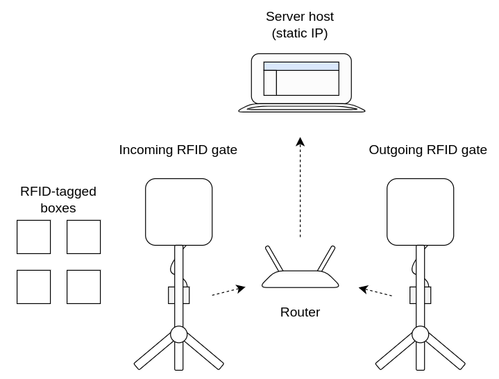
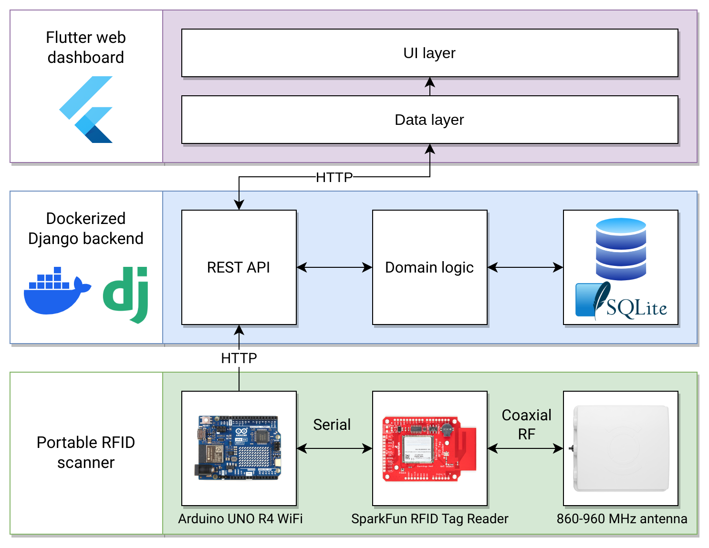

# RFID-Based Inventory Control System (R-BICS)

1. [Physical Setup](#physical-setup)
2. [System Architecture](#system-architecture)

## Physical Setup

The R-BICS system consists of the following components:

- At least two **RFID gates** which scan RFID-tagged items. An RFID gate can be configured to either scan incoming or outgoing items.
- A **server** hosting the R-BICS back-end responsible for:
  - Processing scan events coming from RFID gates
  - Managing the warehouse inventory database
  - Serving a web dashboard that display information about current inventory levels

- A **router** establishing a LAN which:
  - Enables RFID gates to communicate wirelessly with the server host
  - Allows any connected device to access the web dashboard

## System Architecture

## Code Structure

This repository is organized into several subdirectories:

- **device** is dedicated to the RFID scanner device firmware

- **server** is dedicated to the inventory control system web dashboard and backend
