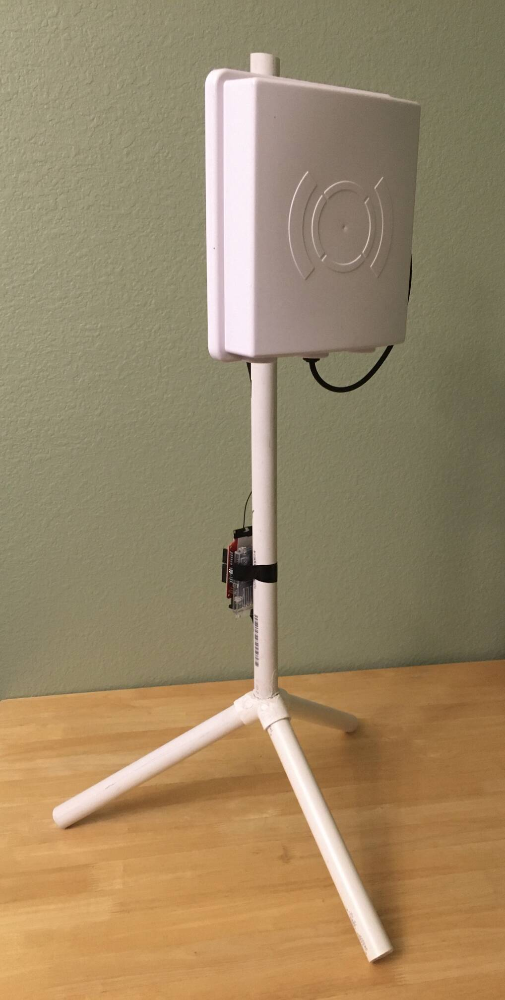
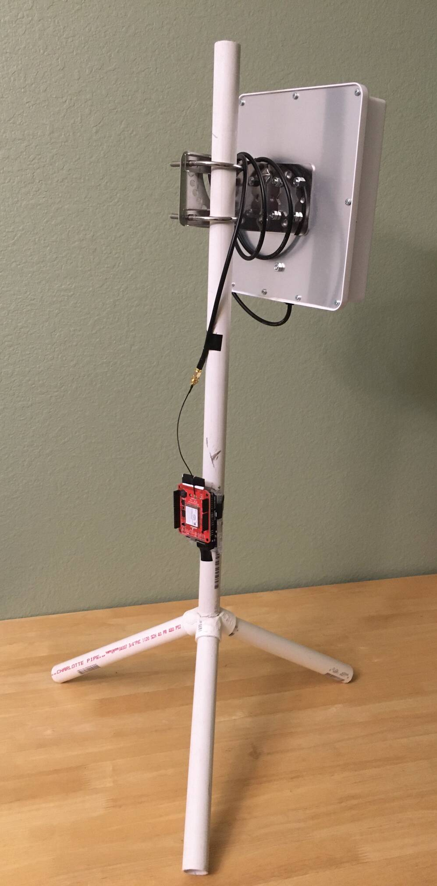
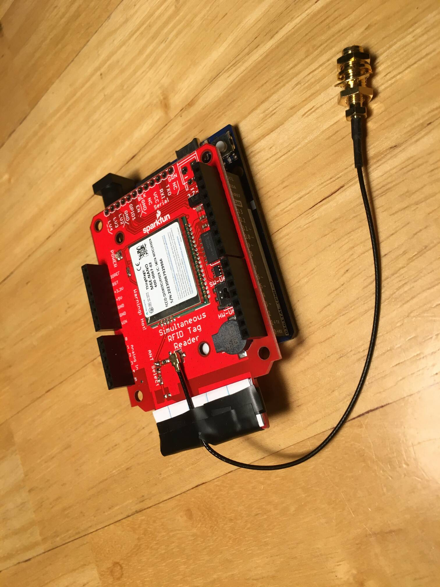

# RFID Gate

This directory contains the RFID gate firmware.

## Hardware Overview

An RFID gate consists of an **antenna assembly** and a detachable **controller unit**. It is designed to scan [Sparkfun UHF RFID tags](https://www.sparkfun.com/products/20228).

### Antenna Assembly

We use a Sparkfun [UHF RFID antenna](https://www.sparkfun.com/products/14131) mounted on a PVC pipe stand. It has a reliable read range of about one meter at 27 dBi (max power).

 

Because the antenna uses an RP-TNC connector, we use an [RP-TNC to RP-SMA conversion cable](https://www.sparkfun.com/products/14132) to connect it to the controller unit.

### Controller

The controller unit consists of a [Sparkfun Simultaneous RFID Reader](https://www.sparkfun.com/products/14066) (SRTR) mounted on an [Arduino UNO R4 WiFi](https://docs.arduino.cc/hardware/uno-r4-wifi/). A [U.FL to RP-SMA conversion cable](https://www.sparkfun.com/products/662) is used to connect it to the antenna.

The controller can be powered either via USB-C or barrel jack power supply. It is recommended to use the 2000 mA power supply since the 500 mA supplied by a USB-C connection will not allow the antenna to operate at full power.

To attach the controller to the antenna assembly:

1. Carefully slot the controller into the plastic holder on the side of the stand, making sure that the end with the coax cable is pointing upwards. Push down on the *edges* of the Arduino (avoid pushing the SRTR) until the controller is firmly attached.
2. Screw the RP-SMA connectors together. Be careful with the U.FL to RP-SMA cable because it is fragile.

## Firmware Development

#### Prerequisites

1. Install and become familiar with the [Arduino IDE (v2)](https://www.arduino.cc/en/software) (at a minimum, know how to compile code and flash the Arduino board).
2. Install the [Sparkfun SRTR Arduino library](https://github.com/sparkfun/SparkFun_Simultaneous_RFID_Tag_Reader_Library).

#### Notes

- The SRTR uses the ThingMagic M6E-Nano as its embedded RFID module. The Nano's API implementation is proprietary and the SRTR Arduino library is Sparkfun's *incomplete* attempt at reverse engineering it. Some library functions are incomplete and some function in an unexpected manner. Consulting the library's source code is necessary for making use of all but the most basic of the SRTR's capabilities.
- The "Arduino programming language" is just C++ with the Arduino library (`Arduino.h`). However, because Arduino boards typically have limited memory, they do not support the C++ standard library. Some of the C standard libraries may be supported.

## Resources

- [Sparkfun SRTR product page](https://www.sparkfun.com/products/14066) - the "Documents" tab provides a lot of useful information about the SRTR
- [Sparkfun tutorials](https://learn.sparkfun.com/) - all sorts of information on working with embedded systems
- [Arduino UNO R4 WiFi documentation](https://docs.arduino.cc/hardware/uno-r4-wifi/)
- [Arduino language reference](https://www.arduino.cc/reference/en/)
- [Arduino library list](https://www.arduino.cc/reference/en/libraries/)

