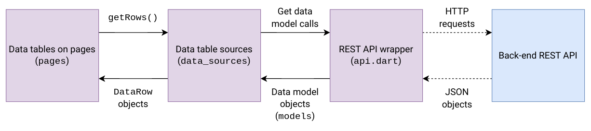

# Web dashboard

This directory contains the web dashboard Flutter project.

## Data flow



## Code structure

The `build/web` directory contains the project build output (served by the Django app) and the `lib` directory contains the actual source code.

```
lib/
├── common/
├── data_sources/
├── models/
├── pages/
├── api.dart
└── main.dart
```

- `common` contains common widgets shared across multiple pages
- `data_sources` contains table data sources
- `models` contains Dart classes corresponding to the data models returned by the back-end REST API
- `pages` contains the web dashboard pages
- `api.dart` contains the wrapper used to access the back-end REST API
- `main.dart` contains the main app entry point and UI elements displayed on all pages (app bar, navigation rail, menu bar)
